# Magic The Learning

In this section, you will include one or two paragraphs providing an overview of your project. Essentially, this part is your sales pitch. At this stage, you should have a name for your project so use it! Don’t introduce the project as a Portfolio project for the diploma. In this section, describe what the project hopes to accomplish, who it is intended to target and how it will be useful to the target audience. 

Magic: The Learning is a website that is designed to help users understand and play the trading card game Magic: The Gathering. It aims to do this by explaining what Magic: The Gathering is, by describing and illustrating what are its cards and how do they function, explaining the best way to build a deck and by talking about all its different formats. 

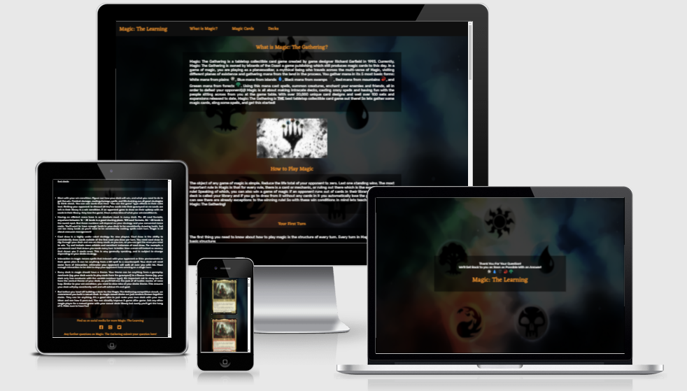

## User Stories

- As a user I want to be able to play the trading card game Magic: The Gathering. I also want to be able to understand the core concepts of this game. 
- As a user I want to know the layout of magic cards, and to understand how they work ingame. 
- As a user I would like to know how I should go about building my first deck. What type of deck I should build, and what type of game of magic I should be playing.

## UX

Paragraph about design choices. Not too much detail as you will have sub categories.

Magic: The Learning's design is meant to be as minimal and as simplistic as possible. Core concepts of Magic: The Gathering are illustrated in simple paragraphs and through illustrated and edited magic card images. The simplistic design choices were favoured as new players to magic will be the main users and so need all the information about the game laid out in simple terms.

### Colour Scheme 

The `#ff8800` orange colour was utilised as it is similar to the colour of the orginal Magic: The Gathering logo font. This original logo served as inspiration for the colour scheme. This colour was used in headings, menu bar, footer and in the logo.

A white colour `#ffffff` was used for most of the text on the site, primarily for the `
` sections. It was also used in the footer for social media icons and to highlight the form link.

The black colour `#f0f0f0` was used as a background colour primarily. It is found in the header and footer as a background colour and serves as an excellent contrast for the orange `#ff8800` colour. 

### Typography 

The eczar font looks similar to the belern font used in Magic: The Gathering products and logos. Since the belern is a copyrighted font and cannot be used outside of Magic: The Gathering products, eczar was the font selected as most appropriate for the logo, titles, header and footer. 

[Eczar](https://fonts.google.com/specimen/Eczar)

Rubik was the other font used throughout the site, in the main body of each section. It's simple and elegant structure was what made it suitable to use as a font, and was important when implementing a simplistic design for the site.

[Rubik](https://fonts.google.com/specimen/Rubik)

### Wireframes

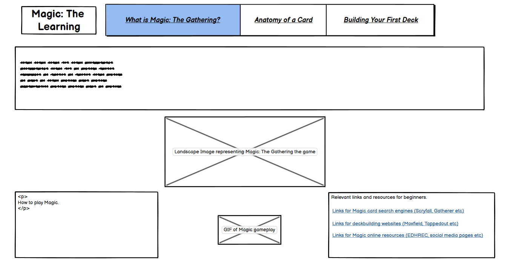

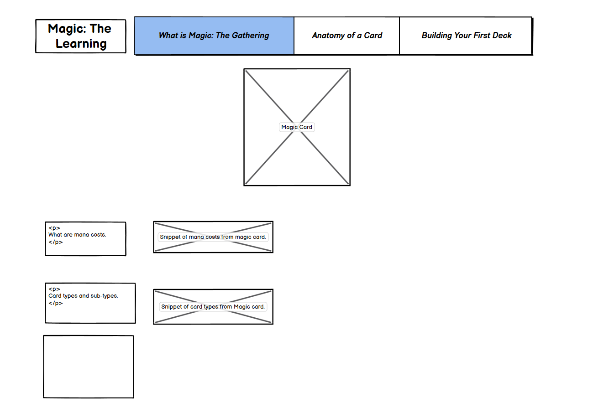

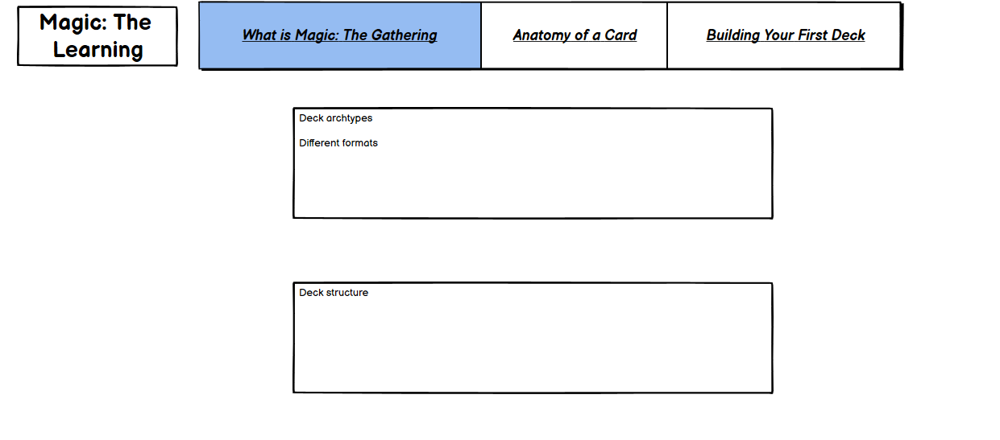

## Features

### Existing Features

- __Index Page__

- Main page of the site. This serves as a general introduction to Magic: The gathering as a game.
- The purpose of this page is to get the user to learn and familiarise themselves with the critical concepts of magic.
- Useful links are also utlisied to help the user find out more about Magic: The Gathering and the larger community by themselves.

  - 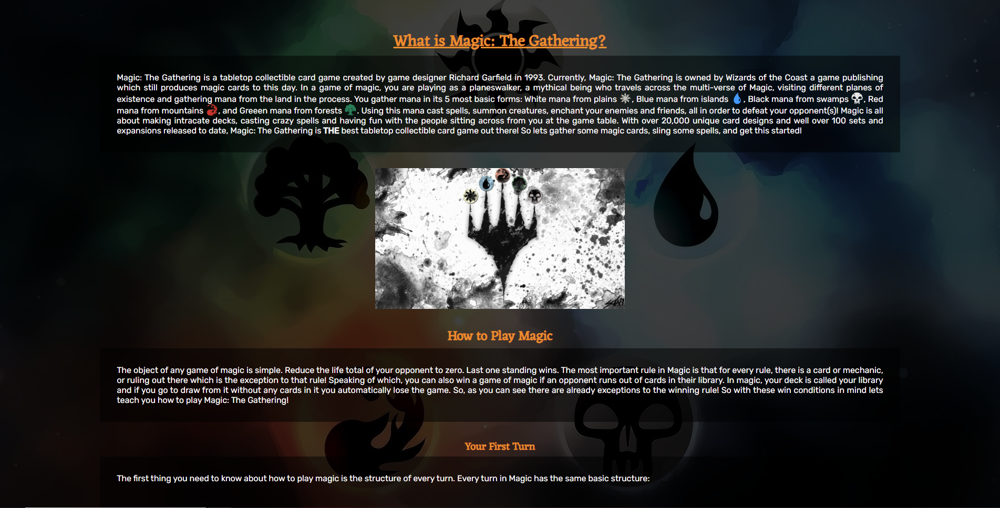

- __Menu Bar__

  - Featured on all pages, contains the logo (Magic: The Learning header) and links to navigate easily around the site.
  - This section will allow the user to easily navigate from page to page across all devices without having to revert back to the previous page via the ‘back’ button. 

  - 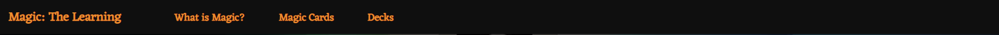

- __Footer__

  - Social media links and a link to a form are found on the footer.
  - The social media icons will bring the user to its specific social media platform. This is so users can connect to the site on their platfomr of choice.
  - It is found on the bottom of every page.

  - 

- __Ask a question about Magic__

  - The form (linked in the footer) lets submit any question about Magic: The Gathering to the website.
  - The user gives their name and email and question, and then the website will respond with an answer to their question.
  - This page is to help the user understand any other concepts about magic not found on this website.

  - 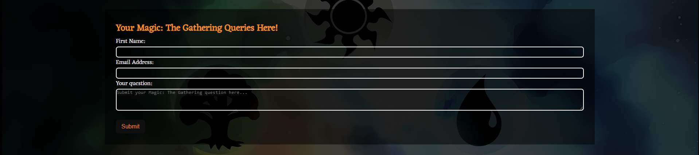

- __Antomy of a card__

  - This page contains an example card labelled and segmented into separate images throughout the page.
  - Its purpose is to teach the user about magic by explaining each aspect of a magic card.
  - Through explaining each aspect of the card more of the game should become clear to the user.

  - 

- __Format & Decks page__

  - Explaining some of the formats in magic will serve as an introduction on deck building. Once they are familiar with some formats the user should be ready to build their  first deck. 
  - The Build your first deck section outlines the basics of deck building, how many lands to include, how many creatures, instants or sorceries should be in your deck.

  - 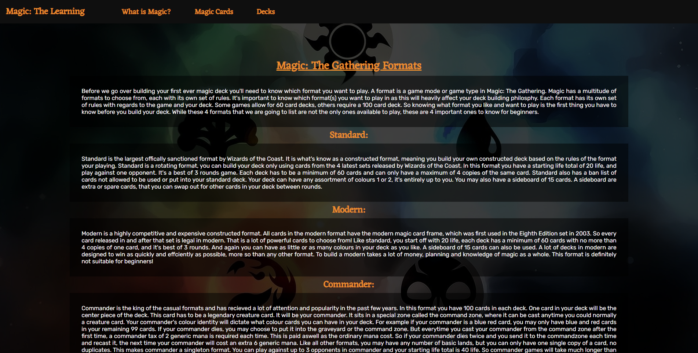

- __Confirmation page__ 

  - Page that you are brought to after submitting your magic question.
  - Will bring you back to the index page after a short period of time.

  - 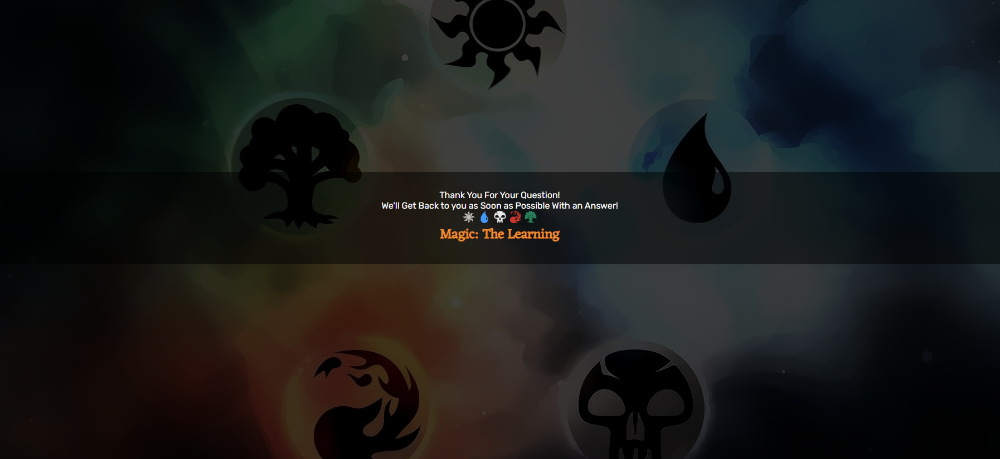

### Features Left to Implement

- Another feature idea

## Technologies

- HyperTextMarkup Langugae (HTML) was the primary programming language used for this project. It was utilised for the main content of the website and as the standard markup language. It was also used because of its ability to be used alongside Cascading Style sheets programming language. [HTML](https://en.wikipedia.org/wiki/HTML)
- Cascading Style Sheets (CSS) was the programming langugae used in conjunction with HTML. It was used to present the markup langugae HTML. CSS was used to put the HTML into a presentable form. [CSS](https://en.wikipedia.org/wiki/CSS)
- Git was the technology used for version control. It is free and open sourced. [Git](https://git-scm.com/)
- GitHub was used as a code hosting site for storing the code for this project online securely. [GitHub](https://github.com/)
- Gitpod is a cloud based IDE which was used to write the code for this project. [Gitpod](https://www.gitpod.io/)
- Balsamiq is a web based mockup tool that was used to create the wireframes for this project. [Balsamiq](https://balsamiq.com/)

## Testing 

In this section, you need to convince the assessor that you have conducted enough testing to legitimately believe that the site works well. Essentially, in this part you will want to go over all of your project’s features and ensure that they all work as intended, with the project providing an easy and straightforward way for the users to achieve their goals.

In addition, you should mention in this section how your project looks and works on different browsers and screen sizes.

You should also mention in this section any interesting bugs or problems you discovered during your testing, even if you haven't addressed them yet.

If this section grows too long, you may want to split it off into a separate file and link to it from here.

### Code Validation

Add screenshots for EACH PAGE after validation! html & css

- HTML
  - Index Page Validation: No errors were returned when passing through the official [W3C validator](https://validator.w3.org/nu/?doc=https%3A%2F%2Fgitmulc.github.io%2Fmagic-the-learning%2Findex.html)
  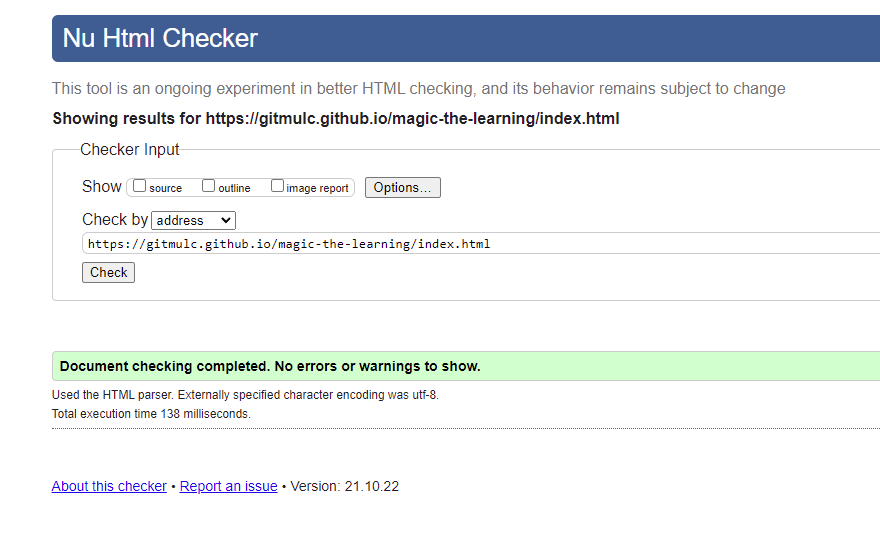
  - Anatomy Page Validation: No errors were returned when passing through the official [W3C validator](https://validator.w3.org/nu/?doc=https%3A%2F%2Fgitmulc.github.io%2Fmagic-the-learning%2Fanatomy.html)
  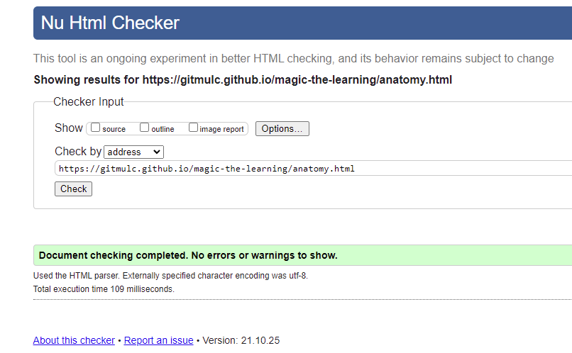
  - Deck Page Validation: No errors were returned when passing through the official [W3C validator]()
  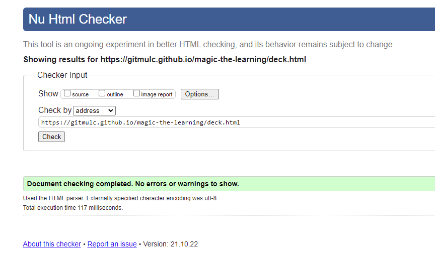
  - Form Page Validation: No errors were returned when passing through the official [W3C validator](https://validator.w3.org/nu/?doc=https%3A%2F%2Fgitmulc.github.io%2Fmagic-the-learning%2Fdeck.html)
  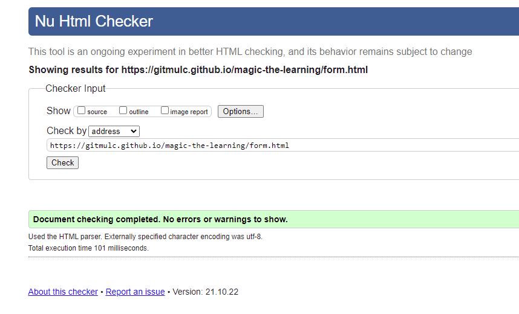
  - Confirmation Page Validation: No errors were returned when passing through the official [W3C validator](https://validator.w3.org/nu/?doc=https%3A%2F%2Fgitmulc.github.io%2Fmagic-the-learning%2Fconfirmation.html%3Ffname%3DConor%26email-add%3Dcmulvo%2540gmail.com%26question%3Dasda)
  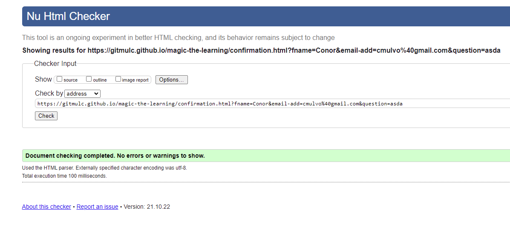
- CSS
  - No errors were found when passing through the official [(Jigsaw) validator](https://jigsaw.w3.org/css-validator/validator?uri=https%3A%2F%2Fgitmulc.github.io%2Fmagic-the-learning%2Findex.html&profile=css3svg&usermedium=all&warning=1&vextwarning=&lang=en)
  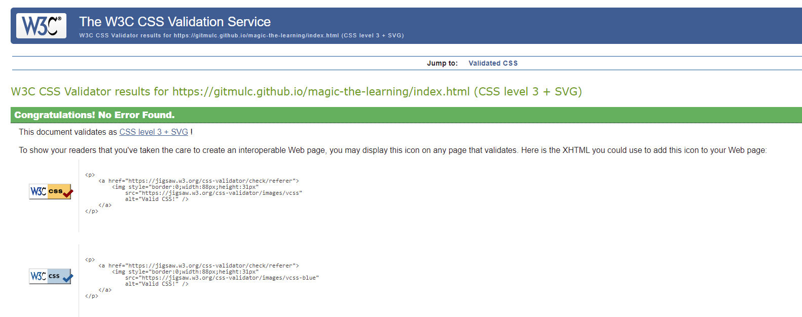

### Browser Compatibility

- Screenshots of all different browsers (min 3)
- Chrome desktop
- Safari Tablet different pg
- Firefox Mobile different pg

### Responsiveness

- Screen shots of different sizes, desktop, tablet and mobile. Re-use images!!!!

### Tested User Stories

- Copy user stories from above, re-use screenshots from features section.

### Unfixed Bugs

You will need to mention unfixed bugs and why they were not fixed. This section should include shortcomings of the frameworks or technologies used. Although time can be a big variable to consider, paucity of time and difficulty understanding implementation is not a valid reason to leave bugs unfixed. 

## Deployment

The site was deployed to GitHub pages. The steps to deploy are as follows:
    * In the [GitHub repository](https://github.com/GitMulC/magic-the-learning), navigate to the Settings tab.
    * From the Settings tab, scroll down until you see the 'Pages' button on the left.
    * From the Source section drop-down menu, select the `Main` branch.
    * Once the `Main` branch has been selected, the page will be automatically refreshed with a detailed ribbon display to indicate the successful deployment.

The live link can be found here - https://gitmulc.github.io/magic-the-learning

### Local Deployment

To make a local copy of this project, you can clone it by typing the following in your IDE terminal:

- `git clone https://github.com/GitMulC/magic-the-learning.git`

Alternatively, if using Gitpod, you can click the green Gitpod button, or use [this link](https://gitpod.io/#https://github.com/GitMulC/magic-the-learning) 

## Credits 

In this section you need to reference where you got your content, media and extra help from. It is common practice to use code from other repositories and tutorials, however, it is important to be very specific about these sources to avoid plagiarism. 

You can break the credits section up into Content and Media, depending on what you have included in your project. 

- Code used for nav bar styling: https://stackoverflow.com/questions/11224069/how-to-place-a-div-at-top-center-position-of-a-page-using-css/48497326
- Used Font Awesome CDN link from Love Running repository: https://github.com/GitMulC/love-running
- Code for HR style https://css-tricks.com/examples/hrs/

### Content 

- The icons in the footer were taken from [Font Awesome](https://fontawesome.com/)
- Coolors.co
- ami.responsive.is
- mspaint

### Media

- Image of Korvold, Fae-Cursed King taken from [Scryfall](https://scryfall.com/card/eld/329/korvold-fae-cursed-king)
- Magic logo image taken from [Pinterest](https://www.pinterest.ie/pin/584834701587956408/)
- SVG icons borrowed from [andrewgioia/mana](https://github.com/andrewgioia/mana)
- SVG filter borrowed from [codepen.io](https://codepen.io/sosuke/pen/Pjoqqp)
- Photopea used for image editing [photopea](https://www.photopea.com/)
- Magic image used for background wallpaper [imgbb.com](https://i.ibb.co/VSYQHPd/magic.png)

Congratulations on completing your Readme, you have made another big stride in the direction of being a developer! 

### Acknowledgements

Below you will find a couple of extra tips that may be helpful when completing your project. Remember that each of these projects will become part of your final portfolio so it’s important to allow enough time to showcase your best work! 

- One of the most basic elements of keeping a healthy commit history is with the commit message. When getting started with your project, read through [this article](https://chris.beams.io/posts/git-commit/) by Chris Beams on How to Write a Git Commit Message 
  - Make sure to keep the messages in the imperative mood 

- When naming the files in your project directory, make sure to consider meaningful naming of files, point to specific names and sections of content.
  - For example, instead of naming an image used ‘image1.png’ consider naming it ‘landing_page_img.png’. This will ensure that there are clear file paths kept. 

- Do some extra research on good and bad coding practices, there are a handful of useful articles to read, consider reviewing the following list when getting started:
  - [Writing Your Best Code](https://learn.shayhowe.com/html-css/writing-your-best-code/)
  - [HTML & CSS Coding Best Practices](https://medium.com/@inceptiondj.info/html-css-coding-best-practice-fadb9870a00f)
  - [Google HTML/CSS Style Guide](https://google.github.io/styleguide/htmlcssguide.html#General)

Getting started with your Portfolio Projects can be daunting, planning your project can make it a lot easier to tackle, take small steps to reach the final outcome and enjoy the process! 